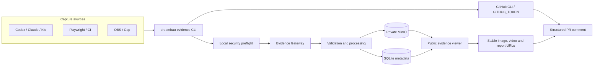

# Dreambau PR Evidence Pipeline Implementation Plan

> **For agentic workers:** REQUIRED SUB-SKILL: Use superpowers:executing-plans to implement this plan task-by-task. Steps use checkbox (`- [ ]`) syntax for tracking. Do not spawn parallel subagents without Frank's explicit approval.

**Goal:** Store screenshots, OBS/Cap videos, Playwright reports, traces and logs centrally on the Dreambau server, serve them over stable HTTPS URLs, and bind them reliably to the matching GitHub pull request.

**Architecture:** Reuse the existing, nearly empty MinIO in `wcr-storage` behind a new Evidence Gateway. MinIO stays private; only the gateway may read and publish objects. Public URLs live under `https://evidence.dreambau.com`. Images embed directly into GitHub markdown; videos get a poster plus a viewer link; Playwright reports render on an isolated, cookie-free report route. The service holds no GitHub token — local runs use the existing `gh` login, GitHub Actions uses its own `GITHUB_TOKEN`.

**Tech Stack:** TypeScript, Express 5, Zod 4, better-sqlite3, esbuild, Vitest, Supertest, Playwright, MinIO (S3 API), Kubernetes + Traefik + cert-manager, Infisical, SigNoz.



## Execution status — 2026-07-25

- **Tasks 1 and 3 are implemented** on `feat/pr-evidence-gateway`: the service foundation and the upload/processing/quarantine pipeline. Task 5 (the CLI) follows in a separate pull request stacked on this one.
- Local gate: all TypeScript projects typecheck, the full test suite passes, `npm run build` and `npm run evidence:build` succeed, and the built gateway answers `/health/live` and `/health/ready` while refusing an unauthenticated API call with 401.
- Three sub-steps are deliberately left open and marked as such below: the optional OCR preflight, image thumbnails (nothing consumes one until the viewer exists) and the seven-day deletion of original video uploads (that is the Task 10 retention job).
- Video processing shells out to ffmpeg through an injected runner. The argument lists are unit-tested; the binary itself is installed by `Dockerfile.evidence` and is a Task 2 deployment concern.
- **Public URLs are minted but do not resolve yet.** `/r/`, `/e/` and `/reports/` are Task 4, so Task 4 makes existing PR comments work rather than changing them.
- Open before this is usable end to end: Task 2 (MinIO bucket, DNS, Kubernetes, Infisical credentials), Task 4 (viewer) and Task 5 (CLI).

## Global Constraints

- Passwords, OTPs, tokens, recovery codes, cookies and browser storage never enter evidence payloads, metadata, captions, logs or backups.
- MinIO stays private: no anonymous bucket policy, no directory listing, no S3 URL ever handed to a client.
- Public IDs carry at least 128 bits of entropy and are not enumerable; public pages set no cookies and are `noindex, nofollow`.
- Stored files are immutable. A corrected file creates a new evidence version instead of overwriting.
- Publishing requires repository, PR number, commit SHA and a completed security check.
- Uploads that fail a security or completeness check land in `quarantine` and never receive a public URL.
- Public content must be synthetic or redacted, because links are deliberately "anyone with the link".
- PR-linked evidence is retained until it is deliberately archived; unpublished raw runs expire after 60 days.
- The service stores no central GitHub PAT.
- The existing Testmails application stays independently deployable throughout.

## Contracts

### Evidence data model

```ts
type EvidenceKind =
  | "screenshot"
  | "video"
  | "playwright-report"
  | "trace"
  | "log"
  | "document"
  | "other";

type EvidenceResult = "PASS" | "FAIL" | "FLAKY" | "BLOCKED" | "INFORMATIONAL";
type EvidenceState = "draft" | "processing" | "quarantined" | "published" | "archived";

interface EvidenceRun {
  schemaVersion: 1;
  id: string;
  publicId: string | null;
  project: "oriso" | "orimo" | "dreambau";
  repository: string;
  pullRequestNumber: number | null;
  pullRequestUrl: string | null;
  commitSha: string;
  environment: "local" | "pre-dev" | "dev" | "production-test";
  title: string;
  result: EvidenceResult;
  source: "codex" | "claude" | "kio" | "github-actions" | "obs" | "cap" | "manual";
  createdAt: string;
  publishedAt: string | null;
  githubCommentUrl: string | null;
  state: EvidenceState;
}

interface EvidenceFile {
  id: string;
  runId: string;
  kind: EvidenceKind;
  filename: string;
  caption: string;
  contentType: string;
  byteSize: number;
  sha256: string;
  primaryActor?: {
    accountId: string;
    username: string;
    syntheticEmail: string;
    role: string;
  };
  publicUrl: string | null;
  viewerUrl: string | null;
  processingState: "pending" | "ready" | "rejected";
}
```

### API v1

```text
POST   /api/v1/runs
POST   /api/v1/runs/:runId/files/init
PUT    /api/v1/runs/:runId/files/:fileId/parts/:partNumber
POST   /api/v1/runs/:runId/files/:fileId/complete
GET    /api/v1/runs/:runId
POST   /api/v1/runs/:runId/publish
PATCH  /api/v1/runs/:runId/github-reference
POST   /api/v1/runs/:runId/archive

GET    /r/:publicId
GET    /e/:publicId/:fileId/:filename
GET    /reports/:publicId/:fileId/*
GET    /health/live
GET    /health/ready
```

Upload endpoints require a project-scoped machine identity. Video uploads support S3 multipart with 64 MiB parts and resume.

Contract details settled during implementation:

- **The part endpoint is an addition to the original list.** Because no S3 address may ever reach a client, the gateway cannot hand out presigned part URLs; it relays the bytes itself, so the parts need an endpoint of their own. `GET /runs/:runId` reports `receivedParts` per file, which is what makes resume work.
- `files/init` carries a base64 `head` field holding the first bytes of the payload, so magic-byte checks run before the bucket sees anything. It is a transport field and is never stored.
- `files/:fileId/complete` answers **422 with the findings** when processing quarantines the file. That is an expected outcome, not a transport error.
- `publish` takes a `stage` of `prepare` or `commit`. `prepare` reserves the public id and returns the prospective addresses without publishing; `commit` publishes and stores `githubCommentUrl` atomically. This is what keeps "published only after the comment succeeded" literally true.
- `publish` is idempotent: republishing keeps the existing public id and the original `publishedAt`, so a link already sitting in a PR comment never changes.
- Images carry a 64 MiB ceiling. The plan named limits for video and documents only; without one, a mistyped screenshot could claim a video-sized slot.

### CLI

```bash
dreambau-evidence upload screenshot.png \
  --project oriso \
  --environment pre-dev \
  --result PASS \
  --title "Invitation redirect verified" \
  --caption "Redirect and landing page validated" \
  --publish
```

By default the CLI derives the GitHub repository, current commit SHA, the open PR for the current branch and the signed-in GitHub account from the local Git repository.

```text
dreambau-evidence upload <files...>
dreambau-evidence publish <run-id>
dreambau-evidence status <run-id>
dreambau-evidence watch <directory>
dreambau-evidence archive <run-id>
dreambau-evidence doctor
```

Without an open PR the default is a clear abort. `--draft` creates a private, non-public raw run with 60-day retention. A public link only ever comes from `publish`.

### PR comment

Every run owns one idempotent comment carrying its marker:

```markdown
<!-- dreambau-pr-evidence:v1 run=<run-id> -->

## Verification evidence

| Result | Environment | Commit | Source |
|---|---|---|---|
| PASS | Pre-Dev | `abc1234` | Codex |

### Invitation redirect

Validated the redirect and final landing page.


[Watch video](https://evidence.dreambau.com/r/...) ·
[Playwright report](https://evidence.dreambau.com/reports/...)
```

Republishing the same `run-id` updates that comment. Different test runs get separate comments.

## Task 1: Evidence contract and service foundation

- [x] Add modules under `src/evidence/server/`, `src/evidence/cli/` and `tests/evidence/`.
- [x] Add separate build entrypoints and a Dockerfile so the Testmails application stays independently deployable. (`tsconfig.evidence.json`, `Dockerfile.evidence`; the existing `npm run build` and `Dockerfile` are untouched.)
- [x] Define the Zod schemas for `EvidenceRun` and `EvidenceFile`, including enum and path validation. (`src/evidence/model.ts`)
- [x] Create the SQLite schema for runs, files, processing, publication, PR references and archival. (`src/evidence/store.ts`)
- [x] Make migrations forward-compatible and separately testable before deployment. (`runMigrations` is exported and applies each version once inside a transaction.)
- [x] Add npm scripts `evidence:dev`, `evidence:build`, `evidence:test`, `evidence:install`.
- [x] Implement `/health/live` and `/health/ready` returning status data only.

Implementation note: the evidence service reuses `src/server/machine-access.ts` for machine identities rather than growing a second identity model. That file gained four additive actions (`evidence:upload`, `evidence:publish`, `evidence:read`, `evidence:archive`) and `machine-credential.ts` gained an optional Keychain service name, so the evidence CLI can use its own `dreambau-evidence` service. Neither change alters existing behaviour.

**Acceptance:** met — the service starts locally, the migration runs twice idempotently, and the health endpoints expose nothing but status.

## Task 2: MinIO and Kubernetes

- [ ] Add `k8s/evidence/` with Deployment `dreambau-evidence` and worker Deployment `dreambau-evidence-worker`.
- [ ] Add Service and Traefik Ingress for `evidence.dreambau.com`.
- [ ] Add a 1 GiB PVC for SQLite and processing state.
- [ ] Add a NetworkPolicy, PodDisruptionBudget and resource requests/limits.
- [ ] Add a CronJob for retention and integrity checks.
- [ ] Create the private bucket `dreambau-pr-evidence` with versioning enabled, no anonymous policy and no directory listing.
- [ ] Issue separate MinIO credentials for gateway and worker, sourced from Infisical into a Kubernetes Secret.
- [ ] Store upload tokens only as SHA-256 hashes or via machine identities.
- [ ] Point `evidence.dreambau.com` at `46.225.160.119` and let cert-manager issue the certificate; leave MinIO on its existing internal route.

**Acceptance:** an unauthenticated API upload returns 401; a gateway test object can be published while its MinIO key stays unreachable from the public internet.

## Task 3: Upload, processing and quarantine

- [x] Enforce allowed image types PNG, JPEG, WebP.
- [x] Enforce video types MP4, MOV, WebM up to 2 GiB per file.
- [x] Enforce log/document types TXT, JSON, Markdown, PDF, ZIP and Playwright trace up to 500 MiB.
- [x] Enforce a 5 GiB per-run ceiling.
- [x] Require MIME type and magic bytes to agree.
- [x] Reject path traversal, executables, SVG and active HTML.
- [x] Always block `.env`, cookies, `storageState`, auth files, PKCS#12, private keys and secret exports.
- [x] Strip EXIF for images. PNG, JPEG and WebP are rewritten in process rather than re-encoded, so a screenshot is never degraded.
- [ ] Generate image thumbnails. The ffmpeg invocation exists and is tested, but nothing consumes a thumbnail until the viewer lands, so it is not wired into the image path — Task 4.
- [ ] Run an OCR preflight for images. Optional in this plan; the `OcrScanner` port exists and is exercised by tests, but no scanner is configured.
- [x] Strip video metadata, generate a poster and normalise incompatible formats to MP4/H.264/AAC.
- [x] Scan logs, reports and ZIP contents for secret and token patterns.
- [x] Serve Playwright HTML exclusively from the isolated report route. (Report entries are extracted onto their own key prefix; the route that reads them is Task 4.)
- [x] Route unsafe or incomplete uploads to `quarantine` with no public URL.
- [ ] Keep the original upload for seven days after successful video normalisation, then remove it while retaining the normalised PR version. (The original and normalised objects are separate keys; the deletion job belongs to the Task 10 retention CronJob.)
- [x] Deduplicate by SHA-256 within a run.

Two rules were sharpened against real evidence rather than taken literally:

- **"Active HTML" means the file *is* markup.** Rejecting any log that quotes a `<script>` tag would quarantine ordinary browser console output. Text evidence is only ever served as `text/plain` or `application/json` with `nosniff`, so quoted markup is inert; a file whose content *starts* as SVG or HTML is refused.
- **Large text is scanned in overlapping windows.** A 400 MiB trace is never buffered whole; the scanner walks it in 8 MiB windows with a 16 KiB overlap so a pattern cannot hide on a window boundary. Archives above 256 MiB are refused outright, because an uninspected archive must not become public.

**Acceptance:** met — forged MIME types, secret files, markup documents, executables, archive traversal, zip bombs and incomplete multipart uploads are all blocked, each with a test.

## Task 4: Public evidence viewer

- [ ] Render `/r/:publicId` with title, result, environment, commit, repository and PR link.
- [ ] Render chronological evidence cards: image with caption, HTML5 video player with poster, download links for logs and traces, link to the isolated Playwright report.
- [ ] Show the test-user assignment without any password material.
- [ ] Set `Content-Security-Policy`, `X-Content-Type-Options: nosniff`, `Referrer-Policy: no-referrer`, `X-Robots-Tag: noindex, nofollow` and `Cross-Origin-Resource-Policy: cross-origin`.
- [ ] Set no cookies on public pages.
- [ ] Support range requests for video scrubbing.
- [ ] HTML-escape captions, filenames and metadata.
- [ ] Use immutable cache headers for direct files while allowing run pages to update.
- [ ] Return 404 without information leakage for unknown public IDs.

**Acceptance:** GitHub renders the images, videos play in the browser, reports run on the isolated origin, and no public index lists runs.

## Task 5: CLI and GitHub linkage

- [ ] Build the portable CLI with esbuild following the existing `test-access` installation pattern.
- [ ] Install to `~/.local/share/dreambau-agent-tools/evidence` with a `~/.local/bin/dreambau-evidence` wrapper.
- [ ] Read the token from the macOS Keychain service `dreambau-evidence`; never place tokens in arguments, the process list, logs or markdown. (Comment bodies also travel on stdin, not argv.)
- [ ] Resolve PR and head SHA through `gh pr view`; require `--pr` when several candidates match.
- [ ] Block uploads to a PR whose head SHA differs unless `--allow-older-commit` is set explicitly.
- [ ] Find the comment by run marker and create or update it idempotently.
- [ ] Set the gateway state to `published` only after the GitHub comment succeeds; on GitHub failure leave the run upload-complete but not published.
- [ ] Implement `status`, `archive` and `doctor`.

Publishing runs in two stages so the state rule holds literally. The comment needs the public addresses, but no address may exist before the pull request records it, so `publish` accepts `stage: "prepare"` — which fixes the public id and returns the addresses a publication *would* create while the run stays unpublished and unreachable — and `stage: "commit"`, which flips the run to `published` and stores the comment url in one step. A GitHub failure between the two leaves an unpublished run with no reachable file; running `publish` again completes it.

The CLI reads files in 64 MiB windows and streams the digest, so a 2 GiB OBS recording never has to fit in memory.

**Acceptance:** one command uploads an image, returns the public URL and creates the correct PR comment; a repeat run creates no second comment.

## Task 6: Portable agent skill and machine installation

- [ ] Write the canonical skill at `${GLOBAL_RULES_ROOT}/skills/dreambau-pr-evidence/SKILL.md`.
- [ ] Register it in the shared skill index and the rule manifest, and link it on M4, the Kio Mac mini and Claude.
- [ ] State the binding rules: evidence belongs on the current PR; a PR-less upload may only be a private draft; screenshots carry caption, step, result, environment, commit and test-user identity; interactive Codex sessions additionally show caption and public image in chat; videos are linked, never inlined as base64 or committed to the repository; secrets and real personal data must never be uploaded; before reporting "done" the agent verifies the evidence comment is actually visible on the PR.
- [ ] Create machine identities `evidence-m4-oriso`, `evidence-kio-oriso` and `evidence-ci-oriso`, each project-scoped and individually revocable.
- [ ] Run the config mirror sync after the skill lands.

**Acceptance:** Codex, Claude and Kio resolve the same skill and produce an identical metadata contract for the same sample file.

## Task 7: OBS, Cap and manual captures

- [ ] Implement `dreambau-evidence watch <directory>` with `--project`, `--environment` and `--pr`.
- [ ] Wait until the file size is stable and the writer has closed the file before uploading.
- [ ] Show the detected file, PR, commit and target environment before upload.
- [ ] Publish directly after a successful upload in automatic mode.
- [ ] Keep failed uploads locally and make them resumable.
- [ ] Document that a Cap recording only counts as durable PR evidence once mirrored through the CLI; a bare Cap link may register as a draft but does not satisfy the PR evidence gate.

**Acceptance:** a finished OBS recording appears as an MP4 with poster on the right PR, and an interrupted upload resumes after a restart.

## Task 8: ORISO E2E pilot

- [ ] Add `scripts/publish-evidence.mjs` and the npm script `evidence:publish` to `ORISO-E2E`.
- [ ] Extend the nightly workflow to publish evidence.
- [ ] Hand over `RUN-STATE.md`, `FIX-LOG.md`, `SCREENSHOT-INDEX.md`, `REPORT.md`, screenshots, videos, traces and the Playwright report.
- [ ] Take the user assignment from `SESSION-LEDGER.md`.
- [ ] Keep PR-less nightly runs as private drafts; publish PR- or `workflow_dispatch`-triggered runs to the PR.
- [ ] Give GitHub Actions only the project-scoped evidence upload secret plus the normal `GITHUB_TOKEN` with `pull-requests: write`, and no MinIO key.
- [ ] Roll out to `ORISO-E2E`, then `ORISO-Frontend`, then `ORISO-Admin`.

**Pilot gate:** three real PRs; at least one PASS and one FAIL run; screenshot, video and Playwright report each covered; exercised on M4, Kio and GitHub Actions; seven days without lost, misattributed or publicly unsafe evidence.

## Task 9: Organisation-wide GitHub rollout

- [ ] Add `.github/workflows/pr-evidence.yml`, `.github/workflows/pr-evidence-caller.yml` and `scripts/deploy-workflows.sh` in `OpenResilienceInitiative/.github`.
- [ ] Make the reusable workflow collect only configured evidence directories and skip repositories without evidence.
- [ ] Publish at most one comment per run and flag missing mandatory evidence visibly.
- [ ] Keep it independent of repository-specific tests and of CodeRabbit/Kio review.
- [ ] After a successful pilot, distribute the caller to all active ORISO repositories via the existing central workflow mechanism.
- [ ] Follow with Dreambau and ORIMO under their own project identities.

## Task 10: Operations, monitoring and recovery

- [ ] Emit SigNoz metrics `evidence_upload_total`, `evidence_upload_bytes_total`, `evidence_processing_duration_seconds`, `evidence_quarantine_total`, `evidence_publish_failures_total`, `evidence_storage_bytes`, `evidence_public_link_probe_failures_total`.
- [ ] Alert on quarantine growth, upload/publish failures, free server space below 40 GiB, a hard upload stop below 25 GiB, MinIO or gateway not ready, and broken public links.
- [ ] Implement retention: 60 days for drafts and unpublished raw data; no automatic deletion for quarantine or published PR evidence.
- [ ] Make archival remove public reachability only; require a separate confirmed admin step for physical deletion.
- [ ] Back up SQLite daily, encrypted.
- [ ] Keep MinIO versioning plus a daily manifest with SHA-256 checksums, and run a restore test with a sample run.
- [ ] Ensure backup and retention processes never log secret content.
- [ ] Document the rollback path: keep the previous gateway/worker image, `kubectl rollout undo` both, disable the ingress and revoke upload tokens first on a security incident, never delete the bucket, PVC or PR comments during rollback, and re-verify public links plus one existing PR comment afterwards.

## Test and acceptance matrix

### Unit and integration

- [ ] Schema, enum and path validation.
- [ ] SHA-256 deduplication within a run.
- [ ] Opaque public ID and non-enumerability.
- [ ] Machine identity project boundaries.
- [ ] Multipart abort and resume.
- [ ] MIME versus magic byte conflicts.
- [ ] Secret, cookie, storage-state and private-key detection.
- [ ] EXIF and video metadata removal.
- [ ] Range requests and correct content types.
- [ ] Idempotent GitHub comment.
- [ ] PR/commit mismatch handling.
- [ ] Retention for draft, published, quarantined and archived states.

### Browser E2E

- [ ] Image renders visibly in the GitHub PR.
- [ ] Caption contains test step and user email.
- [ ] Video plays, pauses and seeks via range request.
- [ ] Playwright report opens on the isolated route.
- [ ] Mobile viewer works.
- [ ] Unknown public ID returns 404 without information leakage.
- [ ] Neither HTML nor caption can execute script.
- [ ] Public pages set no session cookies.

### Live acceptance

- [ ] One AI command publishes a screenshot and a video.
- [ ] The matching PR automatically carries the full evidence comment.
- [ ] Interactive Codex sessions additionally link the same evidence in chat.
- [ ] M4, Kio and GitHub Actions use an identical contract.
- [ ] A missing PR produces no accidental public file.
- [ ] A failed security check produces quarantine only.
- [ ] Old PR comments still work after restart and rollback.
- [ ] SigNoz shows upload, processing, storage and errors.

## Settled assumptions

- The existing MinIO is used, fronted by a new Evidence Gateway.
- Cap and MediaCMS are neither replaced nor promoted to the leading evidence database.
- Rollout order is ORISO-E2E, ORISO-Frontend, ORISO-Admin, then organisation-wide.
- PR evidence is durable; only drafts expire automatically after 60 days.
- Public links are deliberately "anyone with the link", but unlistable and without directory index.
- The service holds no central GitHub PAT.
- A fully public coordination dashboard is out of scope; the run viewer and the PR linkage are its foundation.
