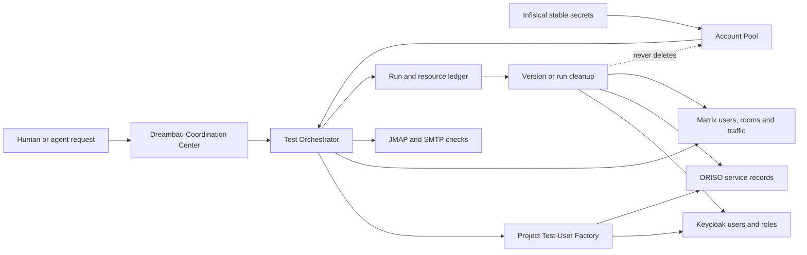

# Autonomous Test Lab Design

**Status:** Approved for implementation on 2026-07-17  
**Project:** Dreambau Test Access and Coordination Center  
**Primary consumers:** Codex, Claude Code on KIO, ORISO developers and product managers

## 1. Outcome

Build an autonomous test laboratory in which an agent can select reusable test
mailboxes, create the application users and roles needed for a scenario, run
API- or Matrix-based conversations at useful scale, record exactly which
application version produced every resource, and remove all resources from a
bad version without deleting the stable mailbox or changing its password.

The operator should be able to request:

- "Run version 4.9 with 20 users, including three consultants and one tenant admin."
- "Show every resource created by version 4.8."
- "Clean version 4.8 and preserve the reusable test identities."

No normal flow asks a person to find, copy or type a test password.

## 2. Invariants

1. The stable mailbox pool is durable. Cleanup never deletes a Stalwart mailbox,
   its Infisical record, its password, private key or address-book identity.
2. Product identities are disposable projections. Keycloak users, ORISO
   UserService rows, Matrix users/rooms, sessions, messages and generated
   artifacts must be traceable to a test run and may be deleted.
3. Secrets stay in Infisical. The run database stores record IDs, e-mail
   addresses and external resource IDs, never passwords, OTP seeds or tokens.
4. Every run records `applicationVersion`, `commitSha`, project, target
   environment, scenario, requested role mix and initiating identity.
5. Every destructive action is append-only audited before and after execution.
6. Load and conversation tests use APIs, JMAP and Matrix clients. Playwright is
   reserved for representative UI acceptance checks.
7. Production is not a supported target. Allowed product targets remain
   `local`, `pre-dev`, `dev` and `production-test` according to existing scope
   rules; destructive automated cleanup initially supports only `local` and
   `pre-dev`.
8. Machine identities are least-privileged by action as well as by project and
   environment.

## 3. System boundaries



### 3.1 Account Pool

The Account Pool is a read model over Infisical `TestAccessRecord` objects plus
local lease state. The 180 mailbox records remain in Infisical. A run leases
records by stable `accountId`; it does not copy their secret into SQLite.

The allocator accepts a role demand such as:

```json
[
  { "role": "consultant", "count": 3 },
  { "role": "tenant-admin", "count": 1 },
  { "role": "user", "count": 16 }
]
```

It selects deterministic, currently unleased mailbox records. If five users are
missing, creation fails atomically with a structured shortage response; no
partial lease survives.

### 3.2 Test-User Factory

Each project supplies an adapter implementing one small interface:

```ts
interface TestUserFactory {
  plan(input: ProvisionRequest): Promise<ProvisionPlan>;
  provision(plan: ProvisionPlan): Promise<ProvisionedResource[]>;
  validate(resources: ProvisionedResource[]): Promise<ValidationResult>;
  cleanup(resources: ProvisionedResource[]): Promise<CleanupResult>;
}
```

The first adapter targets ORISO PreDev. It resolves a scoped platform-admin
record through Test Access, creates Keycloak identities and required UserService
relations, assigns roles, validates login and records every returned external
ID before proceeding. The factory is idempotent by `(runId, accountId, role)`.

### 3.3 Test Orchestrator

The orchestrator owns the state machine:

```text
reserved -> provisioning -> ready -> running -> passed | failed
                                             -> cleanup_pending -> cleaned
                                             -> cleanup_failed
```

It owns account leases, role demand, scenario execution, append-only events and
resource registration. A failed step can resume from the ledger without
recreating successful resources.

Conversation load uses Matrix/API clients with bounded concurrency. A 50-user
test therefore means 50 lightweight clients, not 50 full browsers. A scenario
may attach one or more UI checkpoints that call `test-access session open` for
representative accounts.

### 3.4 Coordination Center

The existing passkey-protected dashboard gains:

- Pool: total, available, leased and role coverage.
- Runs: version, commit, status, role mix, progress and initiator.
- Run detail: timeline, accounts, resources, errors and evidence links.
- Cleanup preview: exact resources that will be removed and invariants that
  will be preserved.
- Prompts and reports: links to durable Markdown, GitHub, Slack or Matrix.

Human project membership continues to scope visible projects. Infisical remains
the vault and is not used as an external identity provider for the dashboard.

## 4. Persistence model

### `test_runs`

- `id`: UUID, primary key
- `project`: `oriso | orimo | dreambau`
- `target_environment`: product target such as `pre-dev`
- `pool_environment`: normally `production-test`
- `application_version`: required human version, for example `4.9`
- `commit_sha`: required 7-64 hexadecimal characters
- `scenario`: stable scenario slug
- `status`: orchestrator state
- `requested_accounts`: integer
- `initiated_by_type`: `human | machine`
- `initiated_by_id`: passkey user or machine identity ID
- `created_at`, `started_at`, `finished_at`, `cleaned_at`

### `test_run_role_demands`

- composite key `(run_id, role)`
- `count`: positive integer

### `test_run_accounts`

- composite key `(run_id, account_id)`
- non-secret snapshot: e-mail, requested role and allocated role
- provisioning state and timestamps

### `account_leases`

- `account_id`: primary key, enforcing one active run per stable identity
- `run_id`, `leased_at`, `expires_at`

### `test_resources`

- `id`: UUID
- `run_id`, optional `account_id`
- `kind`: Keycloak user, product user, Matrix user, room, session, message batch,
  artifact or other adapter-owned kind
- `external_id`, `parent_resource_id`
- `cleanup_order`, status and timestamps
- non-secret JSON metadata

### `test_run_events`

- ordered append-only event ID
- `run_id`, event type, actor, timestamp and non-secret payload

## 5. API contracts

Machine API additions under `/testmails/api/v1`:

- `POST /runs` reserves an entire role demand atomically.
- `GET /runs` and `GET /runs/:id` return only in-scope run data.
- `POST /runs/:id/start` begins orchestration.
- `POST /runs/:id/finish` records `passed` or `failed` plus summary.
- `POST /runs/:id/release` releases leases only when no live resources remain.
- `POST /runs/:id/resources` records a resource immediately after creation.
- `POST /cleanup/preview` lists resources for a run or version.
- `POST /cleanup/execute` removes the previewed resource set in dependency order.

Human dashboard routes expose the same read model through the existing passkey
session and project scope.

Machine identity actions are explicit:

- `accounts:read`
- `sessions:open`
- `runs:read`
- `runs:create`
- `runs:execute`
- `runs:cleanup`

Existing identity files without `actions` receive only the legacy-safe
`accounts:read` and `sessions:open` defaults.

## 6. Cleanup semantics

"Delete version 4.8" means:

1. Select runs where project, target environment and application version match.
2. Generate and persist a cleanup preview.
3. Reject execution if any selected resource lacks a cleanup strategy.
4. Append `cleanup_started` before the first external mutation.
5. Delete resources in descending dependency order.
6. Record each success or failure independently.
7. Release leases only for accounts whose resources are fully cleaned.
8. Mark the run `cleaned` only when every resource is confirmed absent.

Mailbox records and Infisical records are excluded at both schema and adapter
levels; cleanup code has no provider method capable of deleting them.

## 7. Delivery decomposition

1. **Run Ledger and Account Leases:** persistence, scoped API, CLI and audit.
2. **ORISO Test-User Factory:** platform-admin bootstrap, role provisioning,
   login validation and resource registration.
3. **Conversation Orchestrator and Cleanup:** Matrix/API concurrency, run
   execution, version cleanup and resumability.
4. **Team Coordination UI:** pool/run dashboards, diagrams, prompts, reports and
   cleanup previews.

Each delivery is a separate stacked PR with its own tests and review gate.

## 8. Verification

- Domain and database tests prove atomic allocation, lease exclusion, lifecycle
  transitions and secret-free persistence.
- API tests prove project/environment/action scope and no cross-project data.
- Adapter contract tests prove idempotent provision/validate/cleanup behavior.
- Integration tests use fake Keycloak/UserService/Matrix servers before any live
  PreDev run.
- Live acceptance first uses two accounts, then 20, then 50.
- One representative Playwright login proves the UI path; load evidence comes
  from API/Matrix clients and the run ledger.
- Cleanup acceptance proves external resources are gone while mailbox login and
  Infisical secret retrieval remain unchanged.
