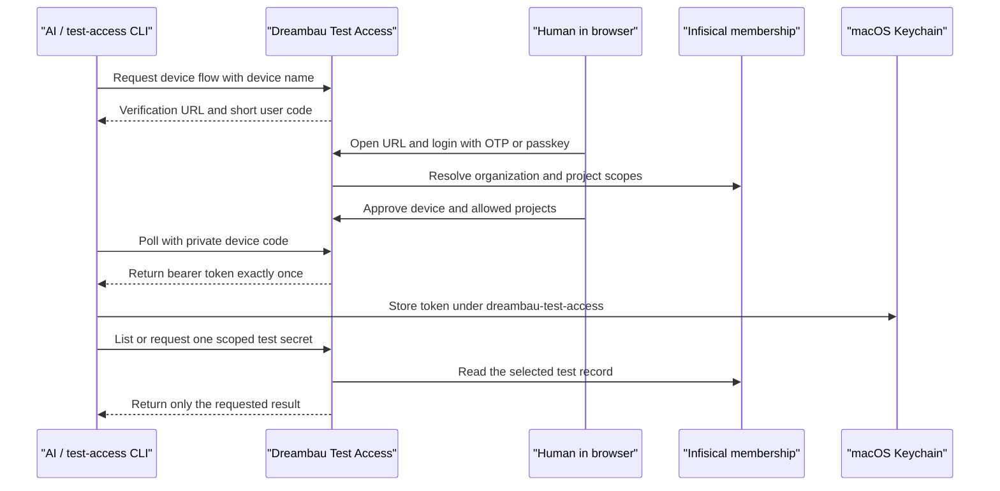

# Email OTP and AI Device Enrollment Design

## Goal

Dreambau Test Access supports two independent but connected access paths:

1. A human member can sign in with a passkey or a one-time code sent to the member's verified email address.
2. A human member can connect an AI workstation without copying a human password, an Infisical session, or a long-lived bearer token into a prompt.

The existing M4 identity `codex-m4-oriso` and Kio identity `agent-mac-mini-oriso` remain valid. Both have been verified against the live Test Access API before this design was written.

## Authorization Boundary

Public signup on `secrets.dreambau.com` is not sufficient. A person is eligible only when Infisical confirms all of the following:

- the account belongs to the Dreambau Test Access organization;
- the account is active;
- at least one approved project membership maps to `oriso`, `orimo`, or `dreambau`;
- the membership uses the configured non-secret access marker rather than a role that exposes Infisical secrets directly.

The hub synchronizes the eligible project set at login and at most every 60 seconds during an active session. A failed Infisical lookup fails closed. Removed project membership removes the corresponding Test Access scope; removed organization membership disables login and enrolled devices.

## Chosen Approach

### Human authentication

- Members may use either a passkey or email OTP as a complete login method.
- Administrators may use email OTP for normal project-scoped reading, but administrative mutations require a recent passkey session.
- Enrollment and recovery codes remain available for recovery and passkey enrollment, but are no longer mandatory for members who choose email OTP.
- A successful email OTP creates a session with method `email-otp`; it does not redirect to mandatory passkey enrollment.

This is preferred over mandatory TOTP because TOTP still requires a separate authenticator enrollment ceremony. TOTP can be added later as another login method without changing the session or authorization model.

### AI authentication

The AI does not sign in as the human and does not receive the human's Infisical password or browser session. It uses a separately revocable device identity tied to the approving human and restricted to a subset of that human's projects and non-production environments.

Device enrollment follows the OAuth device-authorization pattern:



The short user code is not a credential by itself. The private device code never leaves the CLI process. The issued bearer token is shown neither in the browser nor in terminal output and is written directly to macOS Keychain.

## Email OTP Flow

### Endpoints

- `POST /testmails/api/auth/email-otp/request` accepts `{ email }` and always returns the same generic response.
- `POST /testmails/api/auth/email-otp/verify` accepts `{ email, code }` and returns the normal authenticated session response.

### Delivery

- Send from a dedicated Dreambau address through the internal Stalwart SMTP service.
- SMTP credentials come from a mounted Kubernetes Secret and never from Git, Markdown, a ConfigMap, or application logs.
- The email contains a six-digit code, a ten-minute expiry, the requesting browser and approximate time, and instructions to ignore an unexpected request.

### Storage and abuse controls

- Store only a keyed HMAC of the code. A plain SHA-256 hash is insufficient for a six-digit value.
- Consume the code atomically on success.
- Expire after ten minutes.
- Allow five verification attempts per challenge.
- Allow one send per email per minute and apply additional per-IP and global limits.
- Invalidate previous unused challenges when issuing a new one.
- Do not reveal whether an email, Infisical account, or project membership exists.
- Audit request, delivery outcome, verification success, rate limiting, and revocation without storing the code or SMTP response body.

## Human Provisioning and Scope Synchronization

On the first successful OTP verification, the hub creates the local `human_users` row if necessary. The display name and project set are derived from the eligible Infisical membership. Existing users are updated rather than duplicated.

Infisical remains the source of truth for project membership. SQLite contains the local user identifier, cached project scopes, status, authentication metadata, and audit references. It does not contain the person's Infisical password, access token, or test-account passwords.

## Device Identity Model

Dynamic device identities are stored in SQLite and merged with the existing statically provisioned machine identities during migration.

Each device record contains:

- random identity ID and token hash;
- owner user ID;
- human-readable device name;
- approved project and environment scopes;
- allowed actions;
- creation, expiry, last-use, and revocation timestamps.

Rules:

- A member can enroll and revoke only their own devices.
- Device scopes must be a subset of the member's current Infisical scopes.
- Production is never an allowed environment.
- Default actions are read-only account, secret, mail, OTP, environment, session, and test-run operations already permitted by the project policy.
- Tokens expire after 90 days and can be renewed through another browser approval.
- Scope removal or human deactivation immediately invalidates incompatible devices.
- The UI shows device name, scopes, last use, expiry, and revoke action, never token or token hash.

## Client Experience

The portable command becomes:

```text
test-access device login --name "Kio Mac Mini"
```

It prints only a verification URL and short user code, waits for approval, stores the returned token directly in Keychain, and verifies access with a metadata-only request. Subsequent AI sessions use:

```text
test-access list --project oriso --environment pre-dev
test-access get oriso/pre-dev/test-consultant-001
test-access session open oriso/pre-dev/test-consultant-001
```

The shared `dreambau-testmail-api` skill is updated to prefer this hub client. It must no longer require 180 individual mailbox passwords in the local Keychain. Direct mailbox JMAP access remains a narrowly scoped fallback for message debugging, not the default login pipeline.

## UI Changes

The login card adds `Code per E-Mail senden` next to `Mit Passkey anmelden`. After a request, the same card shows the six-digit input, resend countdown, change-email action, and clear expiry/error states.

The authenticated settings area adds `KI-Geräte` with:

- active and expired devices;
- project/environment scopes;
- last-used and expiry timestamps;
- revoke action;
- a page for approving a pending device code.

Passkey management remains visible as the recommended phishing-resistant option, but no longer blocks member access.

## Server Components

- `InfisicalHumanAccessProvider`: resolves organization membership and approved project markers.
- `EmailOtpService`: issues, verifies, rate-limits, and audits OTP challenges.
- `MailSender`: minimal SMTP boundary with no credential or message logging.
- `DeviceAuthorizationService`: owns device codes, browser approval, polling, token issue, expiry, and revocation.
- `DynamicMachineIdentityStore`: supplies active device identities to the existing Test Access API authorization layer.

Each component has a narrow interface and injectable clock/network boundary so it can be tested without live Infisical or SMTP access.

## Failure Behavior

- Infisical unavailable: OTP request keeps its generic response, sends nothing, and records a sanitized failure; existing non-admin sessions fail closed when their cached scope expires.
- SMTP unavailable: no challenge becomes usable; the UI reports that delivery could not be completed without exposing account existence.
- Invalid or expired OTP: generic invalid-code response and remaining-attempt behavior without membership details.
- Device approval expires: CLI exits cleanly and stores nothing.
- Keychain write fails: CLI revokes the newly issued device token immediately and reports a local setup error.
- Scope changes during a run: the next API request re-evaluates the device and returns `403`.

## Verification

Automated tests cover:

- generic request responses and account-enumeration resistance;
- HMAC storage, expiry, single use, replacement, and rate limits;
- first-login provisioning and scope synchronization;
- member OTP access versus passkey-only admin mutations;
- device-code approval, polling, one-time token delivery, expiry, and revocation;
- scope subset enforcement and immediate invalidation;
- Keychain success and rollback on local storage failure;
- existing passkey, recovery, machine identity, session broker, and test-run regressions.

Deployment verification covers:

- database backup before schema migration;
- SMTP delivery to one controlled real address;
- Shazia OTP login in Safari or Chrome;
- one newly enrolled disposable device;
- M4 and Kio regression checks using their existing identities;
- public liveness, readiness, authentication boundary, and JMAP smoke checks.

## Rollout Order

1. Email OTP backend, Infisical human lookup, session policy, and tests.
2. Login UI and Shazia end-to-end proof.
3. Device authorization backend and dynamic identity store.
4. CLI and macOS Keychain enrollment.
5. Shared AI skill update on M4 and Kio.
6. Full regression gate, reviewed PR, SQLite backup, deployment, and live verification.

The first two stages make passkeys optional for members. Stages three through five make the same safe setup self-service for every eligible Dreambau organization member.
