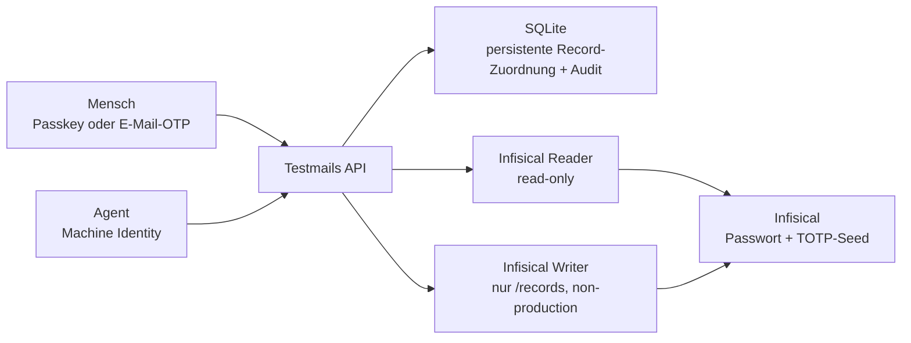

# App-TOTP Test Access Design

## Ziel

Testmails wird das kontrollierte Tor für ORISO-Testzugänge. Infisical bleibt
der einzige Speicherort für Passwort und TOTP-Seed. Menschen und Agenten
arbeiten über dieselben fachlichen Operationen, aber über getrennte
Authentifizierungs- und Berechtigungsgrenzen.

## Bestehende Grundlage

- Test-Access-Records liegen als vollständiges JSON unter `/records`.
- Der technische Infisical-Secret-Name ist eine stabile SHA-256-Ableitung aus
  der fachlichen Record-ID.
- Records enthalten bereits Projekt, Umgebung, E-Mail, App-Passwort und
  optional `totpSecret`.
- Testmails kann App-Records aktuell nur flüchtig über die E-Mail zuordnen.
- Menschen authentifizieren sich per Passkey oder E-Mail-OTP und besitzen
  projektbezogene Grants.
- Agenten authentifizieren sich mit einzeln widerrufbaren Machine Identities,
  deren Projekte, Umgebungen und Actions begrenzt sind.
- Der bestehende OTP-Endpunkt erzeugt bereits TOTP, wenn ein Record einen Seed
  enthält, und fällt sonst auf Mail-OTP zurück.

## Zielarchitektur

### Persistente Zuordnung

SQLite erhält `test_access_record_links` mit:

- normalisierter Testmails-E-Mail,
- fachlicher Record-ID,
- technischem Infisical-Secret-Namen,
- Projekt, Umgebung und Record-Art,
- `last_seen_at`.

`record_id` ist eindeutig. Eine bestehende Record-ID darf niemals still einer
anderen E-Mail zugeordnet werden. Die Erstbefüllung liest vorhandene
App-/Admin-Records, ordnet nur exakte E-Mail-Treffer aus dem bekannten
Springfield-Katalog zu und meldet nicht zuordenbare Records. Der Abgleich ist
idempotent und enthält keine Secretwerte.

### Infisical-Schreibgrenze

Lesen und Schreiben verwenden getrennte Universal-Auth-Credentials. Der
Writer:

1. akzeptiert nur `local`, `pre-dev`, `dev` und `production-test`;
2. berechnet den technischen Secret-Namen aus der fachlichen Record-ID;
3. liest den aktuellen Record gezielt aus `/records`;
4. validiert Schema, Record-ID, Projekt und Umgebung erneut;
5. ersetzt nur `totpSecret` und `updatedAt`;
6. schreibt das vollständige validierte JSON per Infisical-v4-Update;
7. gibt ausschließlich Record-ID und Aktualisierungszeit zurück.

Fehler enthalten weder Upstream-Antworten noch Passwort, TOTP-Seed, Token oder
Infisical-Credentials.

### Menschliche API

- Bestehendes `GET /accounts` nutzt nach dem Reconcile die persistierten Links.
- `POST /accounts/:email/totp` verlangt eine starke menschliche Session,
  Projektzugriff und eine konkrete verknüpfte Record-ID.
- Der Request enthält den TOTP-Seed; die Response enthält ihn nie.
- Ein erfolgreicher Request liefert nur `accountId`, `enrolled` und
  `updatedAt`. Der bereits vorhandene OTP-Abruf liefert anschließend den
  aktuellen sechsstelligen Code.

### Machine API

- `GET /api/v1/lookup` verlangt `accounts:read` und respektiert Projekt- und
  Umgebungsscope.
- `POST /api/v1/accounts/:id/totp` verlangt die neue Action
  `accounts:totp:write`.
- `GET /api/v1/doctor` ist read-only; `repair=true` verlangt zusätzlich
  `accounts:sync` und führt den idempotenten Link-Abgleich nur im Scope der
  Machine Identity aus.
- `production` ist weiterhin kein gültiger Scope. `production-test` bleibt
  eine explizite Testumgebung.

### CLI

Der vorhandene Keychain-gestützte Client erhält:

- `lookup --email ... [--project ...] [--environment ...]`
- `enroll-totp <record-id>`; der Seed kommt verdeckt vom Terminal oder über
  stdin, niemals als Argument
- `otp <record-id> [--json]`
- `doctor [--repair] [--json]`

Ohne `--json` bleibt `otp` absichtlich ein einzelner kopierbarer Code. Fehler
geben Status und stabile Fehlerkennung aus, niemals Response-Body oder Seed.

### UI

Ein App-Login ohne TOTP zeigt `2FA hinterlegen`. Ein shadcn-Dialog enthält ein
Passwortfeld für den Base32-Seed, erklärt kurz die Sicherheitsgrenze und sendet
ihn einmalig. Nach Erfolg wird der Link lokal auf `hasTotp=true` aktualisiert;
der vorhandene `OTP abrufen`-Ablauf bleibt die einzige Stelle, die einen Code
anzeigt.

### Audit

Die bestehende Account-Audit-Timeline wird um `record_linked`,
`lookup_requested`, `totp_enrolled` und `doctor_checked` erweitert. Gespeichert
werden Actor-ID, Record-ID, E-Mail, Aktion, Zeitpunkt sowie Projekt/Umgebung.
Seeds, Passwörter, OTP-Codes und Token werden nie persistiert.

## Fehler- und Sicherheitsverhalten

- unbekanntes Konto oder fremder Scope: `404`, um Existenz nicht offenzulegen;
- fehlende Action: `403 action_denied`;
- fehlender Writer: `503 totp_enrollment_unavailable`;
- ungültiger Base32-Seed: `400 validation_failed`;
- Record-Konflikt oder nicht zuordenbarer Record: Diagnosezähler, kein
  automatisches Raten;
- alle Secret-Antworten und OTP-Antworten: `Cache-Control: no-store`;
- keine Production-Umgebung im Schema oder in Machine Identities.

## Abnahme

1. Bestehende Records werden idempotent zu bekannten Testmails-Konten
   persistiert; unbekannte bleiben sichtbar als Diagnose, aber unverändert.
2. Ein berechtigter Mensch kann TOTP hinterlegen und danach OTP abrufen.
3. Ein berechtigter Agent kann lookup, enroll-totp, otp und doctor ausführen.
4. Falsches Projekt, falsche Umgebung und fehlende Action werden fail-closed
   abgewiesen.
5. Keine API-, CLI-, Audit- oder Fehlermeldung gibt `totpSecret` aus.
6. Unit-, Integrations-, UI- und Playwright-Happy-Path-Tests decken Migration,
   Schreiben, OTP, Berechtigungen und Enrollment ab.

